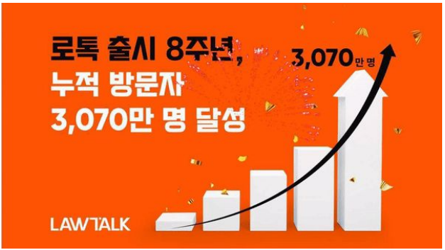
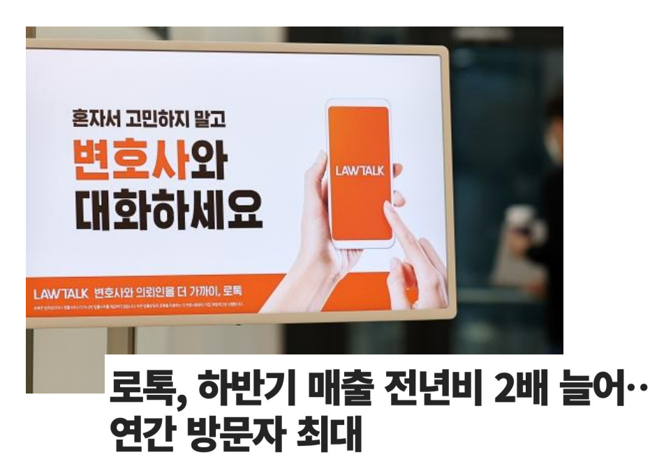
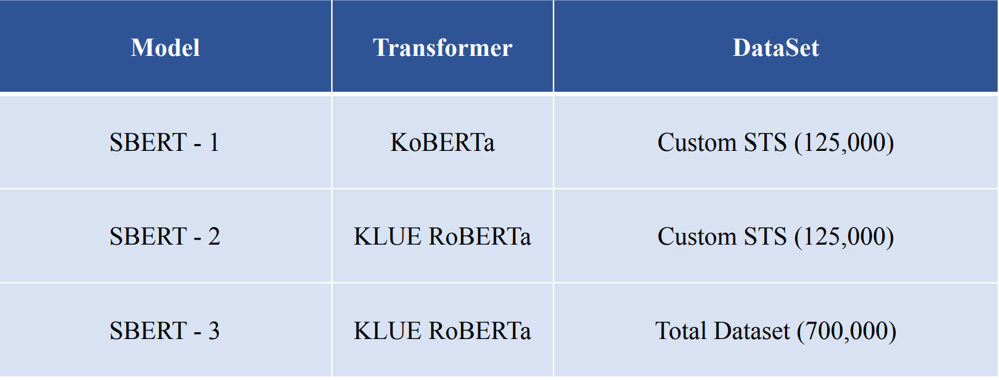

# ⚖️판결문 추천 시스템 ⚖️

딥러닝을 통해 사례와 유사한 재판선례를 통해 빠르게 추천하여 고객들에게 쉬운 정보 제공을 해주고, 전문가를 보조해주는 시스템입니다.

## 👨🏿‍🤝‍👨🏿Member
[노아윤](https://github.com/ayun3738) | [유미리](https://github.com/Yu-Miri) |[황민규](https://github.com/suted2)
:-: | :-: | :-: 
||

## 📋Index
- [📝 Project Summary](#📝project-summary)
- [👀 데이터셋 ](#👀-데이터셋 )
- [📆 Procedures](#📆-Procedures)
- [🔍 Conclusion](#🔍-Conclusion)
- [⚒️ Appendix](#⚒️-Appendix)

## 📝Project Summary
- 개요
  > 딥러닝을 통해 사례와 유사한 재판선례를 통해 빠르게 추천하여 고객들에게 쉬운 정보 제공을 해주고, 전문가를 보조해주는 시스템 개발
- 목적 및 배경

    > 법률 플랫폼 로톡이 서비스 출시 8년 누적 방문자 3070만명을 달성. 누적 법률상담 건수는 약 74만건, 이용자 만족도는 4.89(5점만점)을 기록했습니다. 또한 알기 어려운 법률지식에 관한 정보 접근성이 낮은 일반인중 25%는 로톡을 이용해본 적 있다는 지표도 기사에 같이 있습니다.\
    출처 : https://zdnet.co.kr/view/?no=20220725104905

    
    > 로톡은 순수하게 정보비대칭성이 심한 법률분야에서의 이용자와 변호사를 1대1 매칭시켜주는 플랫폼 자체로 매출을 창출했습니다. 서비스 내에서의 별도 수수료 없이 광고주 변호사들이 선택적으로 진행하는 광고비를 통해서만 수익을 올리고 있습니다.\
    출처 : https://m.wowtv.co.kr/NewsCenter/News/Read?articleId=A202212270077#_PA
  
 💡 우리의 AI 모델을 사용한다면 **기존 판례**들과 상담 사례를 비교하여 가장 유사했던 판례를 추천해줌으로 **승소나 형량** 등 변호사와 이용자에게 빠르게 참고할 수 있는 정보 제공이 가능할 것으로 생각했습니다.
  
- 모델 설계
  > 판례문은 여러개의 문장으로 구상됐고, 판례문마다의 분야도 분류되어 기록되고 있습니다. 따라서 상담 사례의 문장들과 각 판례문의 문장들을 통해 유사도를 기반으로 랭크를 나열하여 가장 관련있다고 판단되는 판례문을 output으로 추천해야 합니다. 이를 위해 Sentence-BERT 모델을 통해 문장임베딩을 추출합니다. \
  꼭 실시간으로 유사 판례문들을 나열할 필요는 없다고 판단하여 정확도에 더 중점을 주어 데이터와 모델을 선정했습니다.
- 기대효과
  > 유사 판례문을 통해 엄청난 양의 판례문들을 전부 뒤져보는 수고를 줄여 변호사 입장에서 시간, 금전적으로 경제적인 효과를 기대할 수 있고, 일반인 입장에서는 판례를 통해 각자의 상황이 어느정도 금액과 시간투자를 해야하는지에 대한 정보제공이 가능할 것입니다.
- 활용 장비 및 재료
  - 라이브러리 : tensorflow, OpenCV, sklearn 
  - 개발 및 협업 툴 : python, colab notebook, vscode(windows), tensorboard  

## 👀 데이터셋 

초기 모델 설계 과정에서 결정한 Sentence-BERT를 fine-tuning하기 위해 한국어 문장들의 유사도가 라벨링되어있는 문장데이터셋이 필요합니다. 

### CaseNote 크롤링
- 출처 : [CaseNote - 간편한 판례검색 서비스](https://casenote.kr/)
- 소개 : 종합법률정보 사이트, 국가법령정보센터 등을 살펴보았을 때 판례문의 데이터가 너무 형식이 다 다르고 문어체도 다르기 때문에 어려움을 겪었습니다.
하지만 casenote는 판례문들의 형식이 어느정도 맞춰져 있었고, 판례문의 구성 방법이나 프로젝트의 기간을 생각했을 때 적절한 데이터를 확보할 만큼의 판례문 양이 있었습니다.
- 라벨 : 
  1. 먼저 "하나의 판례문의 문장들은 하나의 판결에 대한 내용들로 구성되어 있으니 판결문 내에서의 문장들의 유사도는 평균적으로 높을 것이다." 라 가정했습니다.
  2. 따라서 판결문 200개에 대한 문장 조합쌍을 python code를 통해 테이블형식 데이터로 구성했습니다.
  3. 각 문장 조합쌍에 대해 SBERT에 통과시켜 문장 유사도를 Auto labeling하여 데이터셋을 구상했습니다.
  
- 전체 문장 쌍 개수 : 약 125,000

### KLUE 데이터셋
- 출처 : [KorNLI, KorSTS(카카오 브레인 깃허브)](https://github.com/kakaobrain/kor-nlu-datasets)
- 소개 : 영어로 먼저 문장간의 유사도를 라벨링한 데이터를 한국어로 번역하여 데이터를 재구성한 데이터셋
- 라벨 : 
  1. KorNLI(Kor Natural Language Inference) : 기존에 영어로 구성됐던 NLI 데이터셋의 문장을 한글로 번역한 데이터. 문장 Premise(전제), Hypothesis(가설)에 대해 **Entailment(일치하는 문장)**, **Contradiction(반대의미 문장)**, **Neutral(애매한 문장)** 의 3class로 라벨링되어 있습니다.

| Example                                                      | English Translation                                          | Label         |
| ------------------------------------------------------------ | ------------------------------------------------------------ | ------------- |
| P: 저는, 그냥 알아내려고 거기 있었어요. H: 이해하려고 노력하고 있었어요. | I was just there just trying to figure it out. I was trying to understand. | Entailment    |
| P: 저는, 그냥 알아내려고 거기 있었어요. H: 나는 처음부터 그것을 잘 이해했다. | I was just there just trying to figure it out. I understood it well from the beginning. | Contradiction |
| P: 저는, 그냥 알아내려고 거기 있었어요. H: 나는 돈이 어디로 갔는지 이해하려고 했어요. | I was just there just trying to figure it out. I was trying to understand where the money went. | Neutral       |
  
  2. KorSTS(Kor Semantic textual similarity) : 기존에 영어로 구성됐던 STS 데이터셋의 문장을 한글로 번역한 데이터. 두 문장에 대해 **0(관련 없음) ~ 5(문장의미가 일치)** 로 사람이 스코어를 메긴 점수로 라벨링이 되어 있습니다.

| Example                                                      | English Translation                                      | Label |
| ------------------------------------------------------------ | -------------------------------------------------------- | ----- |
| 한 남자가 음식을 먹고 있다. 한 남자가 뭔가를 먹고 있다. | A man is eating food. A man is eating something.    | 4.2   |
| 한 비행기가 착륙하고 있다. 애니메이션화된 비행기 하나가 착륙하고 있다. | A plane is landing. A animated airplane is landing. | 2.8   |
| 한 여성이 고기를 요리하고 있다. 한 남자가 말하고 있다. | A woman is cooking meat. A man is speaking.      | 0.0   |

## ⚙️ Modeling
  
>- 여러 질병의 위험도를 각각 분석하기 위해 10개의 모델을 연결하는 pipeline을 구상
> 
>
>**[2023.03.15 ~ 2023.03.21]**
>- 데이터 수집 및 전처리  
>- 데이터의 사이즈가 중구난방으로 다름을 확인했고, 분류모델으로 ResNet Fine-Tuning을 생각하고 있었기 때문에 224x224로 resize
>- 10 class의 질병별 유무 라벨링, 분류모델로 이미지 데이터량이 충분하다고 판단하여 질병당 training data 20000image 이하로 제한
> 
>
>**[2023.03.22 ~ 2023.03.30]**
>- Train, valid dataset 8:2 split
>- Model training and testing
>- test한 결과 바탕으로 부실한 모델들 데이터 전처리를 수정하여 모델학습 재진행
>- 최종 모델의 test recall, f1_score 기준으로 sigmoid threshold를 결정 
>- 트레이닝 코드 :  &nbsp;

## 🔍 Conclusion

### Inference

한장 또는 여러장의 강아지 눈사진을 이용자가 찍으면, 의심되는 질병을 알려준다.

### Conclusion & Extension
1. Classification에 대표적인 ResNet을 transfer learning하여 안구판별기 모델을 학습시켜 동작함을 확인했다.
-> 단순 classfication 뿐 아니라 AIhub 데이터에 detection labeling도 있었으므로 이후 강아지 사진에서 detection, 안구판별까지 한번에 가능하리라 예상됨.
2. 하드웨어적 한계로 이미지 크기를 224x224로 줄여서 학습시킬수 밖에 없었던 점이 아쉬웠다. -> 학습수준에서는 colab 노트북으로 프로젝트를 진행하였지만 추후 이미지 크기를 조정하면 더 정확한 판별기를 모델링할 수 있으리라 예상됨.

## ⚒️ Appendix

| Reference | Paper |
| ---- | ---- |
| ResNet |  &nbsp; 