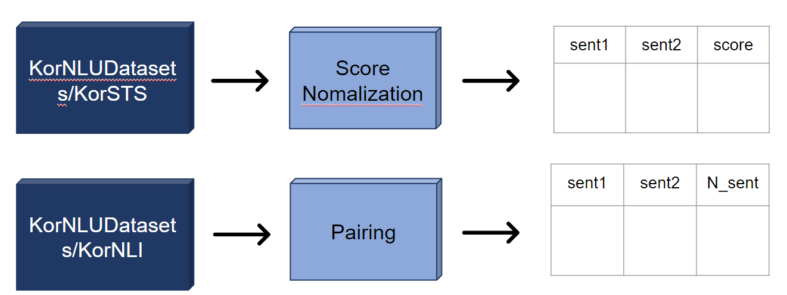

# ⚖️판결문 추천 시스템 ⚖️

딥러닝을 통해 사례와 유사한 재판선례를 통해 빠르게 추천하여 고객들에게 쉬운 정보 제공을 해주고, 전문가를 보조해주는 시스템입니다.

## 👨🏿‍🤝‍👨🏿Member
[노아윤](https://github.com/ayun3738) | [유미리](https://github.com/Yu-Miri) |[황민규](https://github.com/suted2)
:-: | :-: | :-: 
||

## 📋Index
- [📝 Project Summary](#📝project-summary)
- [👀 데이터셋 ](#👀-데이터셋 )
- [⚙️ Modeling](#⚙️-modeling)
- [🔍 Conclusion](#🔍-conclusion)
- [⚒️ Appendix](#⚒️-appendix)

## 📝Project Summary
- 개요
  > 딥러닝을 통해 사례와 유사한 재판선례를 통해 빠르게 추천하여 고객들에게 쉬운 정보 제공을 해주고, 전문가를 보조해주는 시스템 개발
- 목적 및 배경

    > 법률 플랫폼 로톡이 서비스 출시 8년 누적 방문자 3070만명을 달성. 누적 법률상담 건수는 약 74만건, 이용자 만족도는 4.89(5점만점)을 기록했습니다. 또한 알기 어려운 법률지식에 관한 정보 접근성이 낮은 일반인중 25%는 로톡을 이용해본 적 있다는 지표도 기사에 같이 있습니다.\
    출처 : https://zdnet.co.kr/view/?no=20220725104905

    
    > 로톡은 순수하게 정보비대칭성이 심한 법률분야에서의 이용자와 변호사를 1대1 매칭시켜주는 플랫폼 자체로 매출을 창출했습니다. 서비스 내에서의 별도 수수료 없이 광고주 변호사들이 선택적으로 진행하는 광고비를 통해서만 수익을 올리고 있습니다.\
    출처 : https://m.wowtv.co.kr/NewsCenter/News/Read?articleId=A202212270077#_PA
  
 💡 우리의 AI 모델을 사용한다면 **기존 판례**들과 상담 사례를 비교하여 가장 유사했던 판례를 추천해줌으로 **승소나 형량** 등 변호사와 이용자에게 빠르게 참고할 수 있는 정보 제공이 가능할 것으로 생각했습니다.
  
- 모델 설계
  > 판례문은 여러개의 문장으로 구상됐고, 판례문마다의 분야도 분류되어 기록되고 있습니다. 따라서 상담 사례의 문장들과 각 판례문의 문장들을 통해 유사도를 기반으로 랭크를 나열하여 가장 관련있다고 판단되는 판례문을 output으로 추천해야 합니다. 이를 위해 Sentence-BERT 모델을 통해 문장임베딩을 추출합니다. \
  꼭 실시간으로 유사 판례문들을 나열할 필요는 없다고 판단하여 정확도에 더 중점을 주어 데이터와 모델을 선정했습니다.
- 기대효과
  > 유사 판례문을 통해 엄청난 양의 판례문들을 전부 뒤져보는 수고를 줄여 변호사 입장에서 시간, 금전적으로 경제적인 효과를 기대할 수 있고, 일반인 입장에서는 판례를 통해 각자의 상황이 어느정도 금액과 시간투자를 해야하는지에 대한 정보제공이 가능할 것입니다.
- 활용 장비 및 재료
  - 라이브러리 : pytorch, sklearn 
  - 개발 및 협업 툴 : python, colab notebook, vscode(windows), 

## 👀 데이터셋 

초기 모델 설계 과정에서 결정한 Sentence-BERT를 fine-tuning하기 위해 한국어 문장들의 유사도가 라벨링되어있는 문장데이터셋이 필요합니다. 

### CaseNote 크롤링
- 출처 : [CaseNote - 간편한 판례검색 서비스](https://casenote.kr/)
- 소개 : 종합법률정보 사이트, 국가법령정보센터 등을 살펴보았을 때 판례문의 데이터가 너무 형식이 다 다르고 문어체도 다르기 때문에 어려움을 겪었습니다.
하지만 casenote는 판례문들의 형식이 어느정도 맞춰져 있었고, 판례문의 구성 방법이나 프로젝트의 기간을 생각했을 때 적절한 데이터를 확보할 만큼의 판례문 양이 있었습니다.
- 라벨 : 
  1. 먼저 "하나의 판례문의 문장들은 하나의 판결에 대한 내용들로 구성되어 있으니 판결문 내에서의 문장들의 유사도는 평균적으로 높을 것이다." 라 가정했습니다.
  2. 따라서 판결문 200개에 대한 문장 조합쌍을 python code를 통해 테이블형식 데이터로 구성했습니다.
  3. 각 문장 조합쌍에 대해 SBERT에 통과시켜 문장 유사도를 Auto labeling하여 데이터셋을 구상했습니다.
  
- 전체 문장 쌍 개수 : 약 125,000

### KLUE 데이터셋
- 출처 : [KorNLI, KorSTS(카카오 브레인 깃허브)](https://github.com/kakaobrain/kor-nlu-datasets)
- 소개 : 영어로 먼저 문장간의 유사도를 라벨링한 데이터를 한국어로 번역하여 데이터를 재구성한 데이터셋
- 라벨 : 
1. KorNLI(Kor Natural Language Inference) : 기존에 영어로 구성됐던 NLI 데이터셋의 문장을 한글로 번역한 데이터. 문장 Premise(전제), Hypothesis(가설)에 대해 **Entailment(일치하는 문장)**, **Contradiction(반대의미 문장)**, **Neutral(애매한 문장)** 의 3class로 라벨링되어 있습니다.

| Example                                                      | English Translation                                          | Label         |
| ------------------------------------------------------------ | ------------------------------------------------------------ | ------------- |
| P: 저는, 그냥 알아내려고 거기 있었어요. H: 이해하려고 노력하고 있었어요. | I was just there just trying to figure it out. I was trying to understand. | Entailment    |
| P: 저는, 그냥 알아내려고 거기 있었어요. H: 나는 처음부터 그것을 잘 이해했다. | I was just there just trying to figure it out. I understood it well from the beginning. | Contradiction |
| P: 저는, 그냥 알아내려고 거기 있었어요. H: 나는 돈이 어디로 갔는지 이해하려고 했어요. | I was just there just trying to figure it out. I was trying to understand where the money went. | Neutral       |
  
2. KorSTS(Kor Semantic textual similarity) : 기존에 영어로 구성됐던 STS 데이터셋의 문장을 한글로 번역한 데이터. 두 문장에 대해 **0(관련 없음) ~ 5(문장의미가 일치)** 로 사람이 스코어를 메긴 점수로 라벨링이 되어 있습니다.

| Example                                                      | English Translation                                      | Label |
| ------------------------------------------------------------ | -------------------------------------------------------- | ----- |
| 한 남자가 음식을 먹고 있다. 한 남자가 뭔가를 먹고 있다. | A man is eating food. A man is eating something.    | 4.2   |
| 한 비행기가 착륙하고 있다. 애니메이션화된 비행기 하나가 착륙하고 있다. | A plane is landing. A animated airplane is landing. | 2.8   |
| 한 여성이 고기를 요리하고 있다. 한 남자가 말하고 있다. | A woman is cooking meat. A man is speaking.      | 0.0   |

## ⚙️ Modeling

참고 깃허브 : https://github.com/jhgan00/ko-sentence-transformers

### 1. 데이터 전처리(KULE 데이터)

>- KorNLI : KorNLI 데이터에서 일치하는 문장 두개와 무작위의 반대의미 문장까지 3가지 문장쌍을 데이터셋으로 구성하는 Pairing 방식을 사용하여 구상했습니다.

 

>- KorSTS : KorSTS 데이터에서 0~5의 점수를 **0 ~ 1**으로 normalization 했습니다.

 

### 2. 데이터 전처리(크롤링 custom 데이터)

>- casenote에서 크롤링한 판례문들의 판례문에서 '이유' 부분의 텍스트가 판례의 내용을 담고 있다고 판단하여 그부분을 .csv 파일로 저장했습니다,

 

>- 이후 한글 외의 문자, 숫자를 제거하고, 데이터 특성상 판결문의 글머리(ex. 가, 나, 다)와 형식적 단어(ex. 사건개요) 등의 불용어 제거했습니다.

 

>- 그 뒤 하나의 판결문에 대해 문장들을 분리하여 각각의 cosine 유사도를 포함한 데이터쌍을 구상하여 KorSTS에서의 값들처럼 **0 ~ 1**사이의 값으로 구성했습니다.

 

>- 기존 참고한 Sentence BERT 학습 코드에서 판결문 관련 custom 데이터를 추가함으로 유사 판결문을 더 잘 판별할 것으로 기대하였고, transformer도 바꿔가며 학습을 진행했습니다.
>- 트레이닝 코드 : [training_last.py](training_last.py), [data_util.py](data_util.py)

## 🔍 Conclusion

### Inference

#### 1. 문장 스코어 자체의 성능

> 기존 reference로 학습된 open model인 SBERT를 SBERT-0로 잡고 학습시킨 모델들을 비교하기로 했습니다.

 

> - 실제 사례나 판례의 유사한 두 문장을 입력했을 때, 유사도의 성능을 측정한 결과 높게 측정되었습니다.

 

> - 실제 사례나 판례의 엉뚱한 두 문장을 입력했을 때, 유사도의 성능을 측정한 결과 낮게 측정되었습니다.
- SBERT-0의 경우, 유사한 문장의 스코어가 애매한 0.5 부근으로 측정되어 적절한 모델이 아님으로 생각됐습니다.
- SBERT-1의 경우, 엉뚱한 문장의 스코어가 애매한 0.5 부근으로 측정되어 적절한 모델이 아님으로 생각됐습니다.
- SBERT-2의 경우, 유사한 문장과 엉뚱한 문장의 스코어가 둘 다 높은 수준으로 나와 적절한 모델이 아님으로 생각됐습니다.
- 하지만 데이터를 늘린 SBERT-3의 경우, 유사한 문장과 엉뚱한 문장의 스코어가 어느정도 구분 가능한 수준으로 나와 적합한 방식의 학습이 진행됐다고 판단했습니다.

#### 2. 실제 사례를 통한 유사 판결문 추천

- 실제 상담사례를 가져와 넣었을 때, 의료판결문 중에서도 백내장 관련 판례를 가장 높은 유사성 판례로 추천해주는 것을 확인했습니다.

 

### Conclusion & Extension
1. 생성형 NLP에서 대표적인 BERT모델의 문장유사도를 통해 판결문의 각 문장과 연결지어 전체 판결문과의 유사도를 구하는 유사판례문 추천모델을 학습시켜 동작함을 확인했습니다.
하지만 아직 그저 문장간 평균을 내거나, 유사 문장의 최대값으로 살펴본다던지하는 단순한 알고리즘으로 판결문을 도출합니다.
-> 모델의 output에서 가장 유사한 판결문을 판단하는 알고리즘을 개선시켜 좋은 시스템으로 발전시킬 수 있습니다.
2. NLP 모델의 특성상 task에 잘 맞는 정제된 많은 문장이 필요합니다. 하지만 사이트 및 판결문마다 작성된 구조가 달라서 시간상 크롤링 데이터를 많이 담지 못한 점이 모델 성능의 아쉬운 점이라고 생각됩니다. 또한 데이터셋 생성 과정에서 cosine 유사도를 통한 labeling을 진행했는데, 이의 타당성을 검증하는 과정도 필요하다고 생각됩니다.
3. 판결문 200개에서 문장 조합이 125,000개로 불어나면서 많은 판례문을 타겟으로 삼을수 없어 우선 분야를 '의료'분야의 판례문만 가지고 프로젝트를 진행했지만, 이러한 방식으로 다른 분야에 맞는 여러 모델을 통해 판결문 추천도 가능할 것입니다.

## ⚒️ Appendix

| Reference | Git | Paper |
| ---- | ---- | ---- |
| SBERT 학습 코드 | https://github.com/jhgan00/ko-sentence-transformers|  &nbsp;
| 카카오 브레인 KLUE | https://github.com/kakaobrain/kor-nlu-datasets |  &nbsp;
